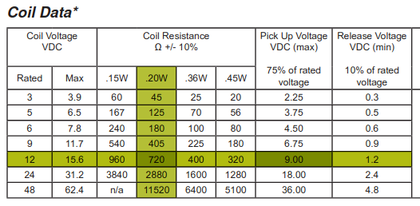

# LoRa-Latch
An automatic apartment door latch using Arduino and LoRa

### Context
My building has an ancient intercom system that allows visitors to buzz my apt
and a button that allows me to unlock the main door. This project allows me to
unlock the main door by buzzing my apt but only for a set period of time after
receiving a signal via a LoRa module.

### LoRa Modules
  
Check out my LoRa Boilerplate project for details on how I built these modules  
[https://github.com/jonmon6691/arduino_lora_boilerplate](https://github.com/jonmon6691/arduino_lora_boilerplate)

### Wiring

### Choosing the capacitor
The capacitor in this circuit, along with the diode, from a half-bridge rectifier.
Because the buzzer is an AC signal, we need to rectify it to DC in order to drive
the relay coil.

The AC supply is 60Hz 13VRMS, and to find the peak-to-peak voltage we just multiply by
sqrt(2), which ends up being 18V. In fact, knowing this helped me pick the relay!
[J104D2C12VDC.20S](https://www.citrelay.com/Catalog%20Pages/RelayCatalog/J104D.pdf)

Looking at the datasheet, we can see that the coil is **720Ohms** and the minimum voltage needed to activate the relay is **9V**

Now that we know the voltage, and the load (coil of the chosen relay), we can
do some simulation to check and see if some spare capacitors I have will do the job!

