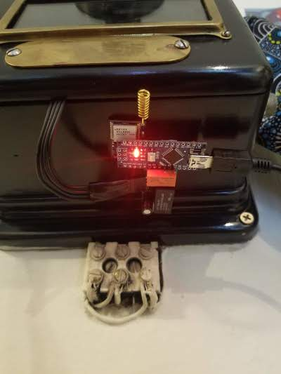
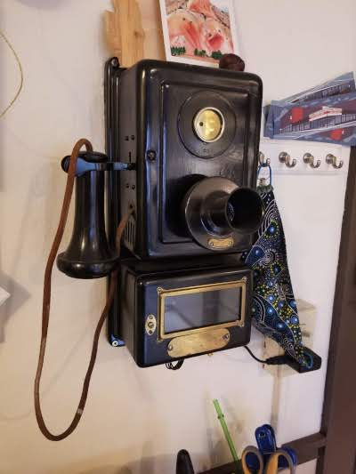
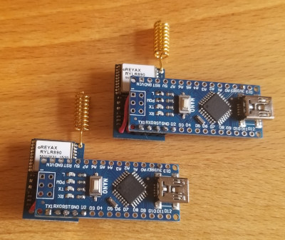
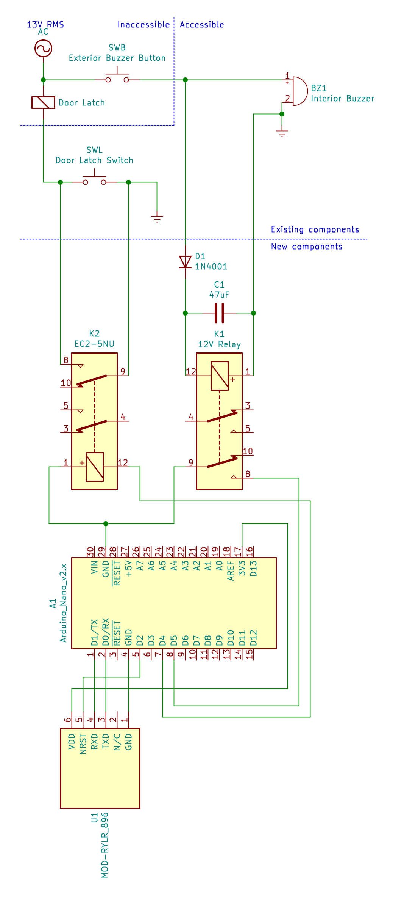
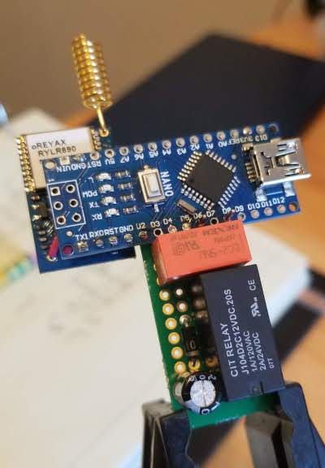
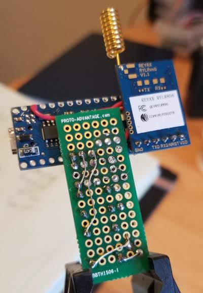
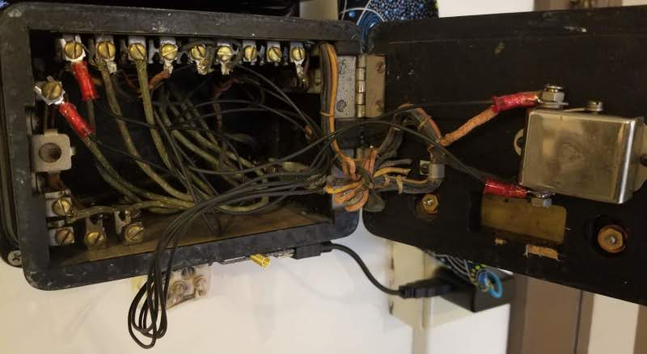
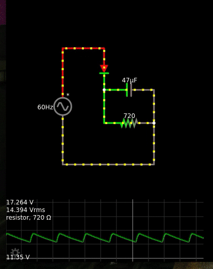

# LoRa-Latch
A remote keyless entry system for ancient apartment door latches using Arduino and LoRa

 

## Context
Older apartment buildings have hard-wired intercom systems that allow visitors
to activate a buzzer in an apartment. The resident has a button inside that
allows the main building door to be unlocked. This project takes those features
and creates a type of keyless-entry system for the resident to use when they
get home.

## How it works
1. The remote stays in the resident's vehicle and acts as a beacon, transmitting
an unlock code periodically.
2. The latch module is integrated into the apartment
building wiring and listens for the unlock code.
3. When the latch module receives the unlock code, it starts a five minute timer.
4. After the vehicle is parked, the remote stops transmitting.
5. If the apartment is buzzed before the timer runs out, the door latch will be triggered, allowing the resident into the building without using their key.

## LoRa Modules
Check out the LoRa Boilerplate project for details on how these modules are built.
[https://github.com/jonmon6691/arduino_lora_boilerplate](https://github.com/jonmon6691/arduino_lora_boilerplate)

  

## Latch Module Wiring

 

### Designing the half-bridge rectifier
* The latch module uses a relay and a half bridge rectifier in order to detect
that the buzzer is active.
* Buzzer power is 13VRMS at 60Hz
* [Relay](https://www.citrelay.com/Catalog%20Pages/RelayCatalog/J104D.pdf) coil is 720Ohms and requires between 9 and 15.6 volts

Using that information, a simulation can be built to evaluate
readily-available capacitor values:

## Next steps
* **Add security:** right now, any LoRa message at all will trigger the unlock
timer... Not good! The LoRa modules implement AES encryption so a nice
challenge-response authentication could even be possible! The absolute
obscurity of this installation, combined with how often the door is proped open
anyway, make this a less critical problem for the time being.
* **More efficient remote:** Add a battery and charger circuit so that the
unlock code is only sent when the car is turned off. Right now, the unlock code
is sent at all times while the car is on.
