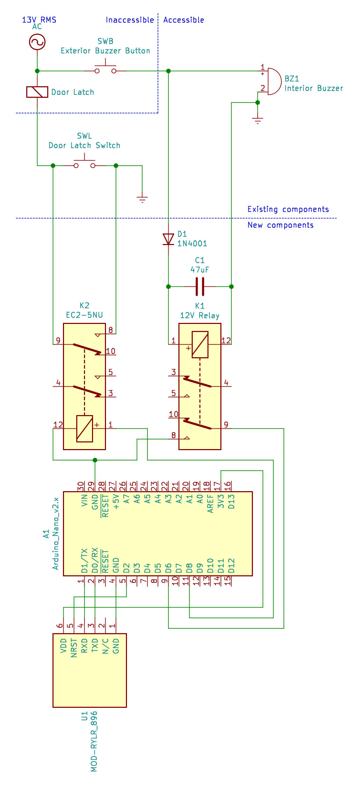
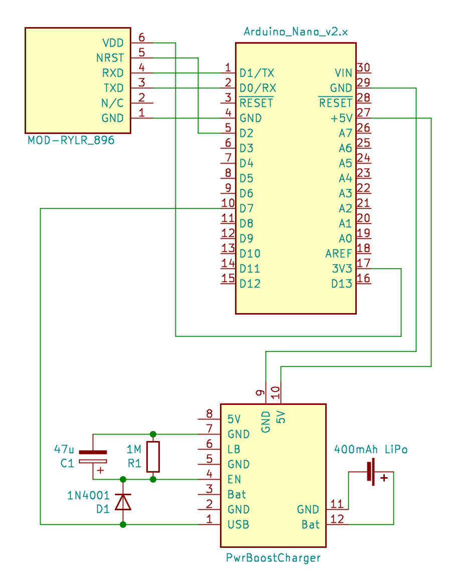
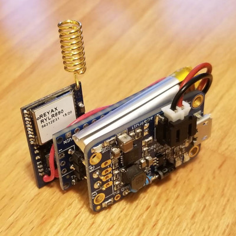
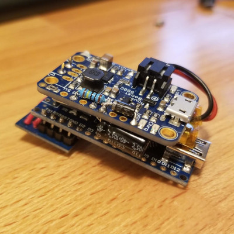

# LoRa-Latch
A remote keyless entry system for ancient apartment door latches using Arduino and LoRa

 

## Context
Older apartment buildings have hard-wired intercom systems that allow visitors
to activate a buzzer in an apartment. The resident has a button inside that
allows the main building door to be unlocked. This project takes those features
and creates a type of keyless-entry system for the resident to use when they
get home.

## How it works
1. The remote stays in the resident's vehicle and acts as a beacon, transmitting
an unlock code periodically.
2. The latch module is integrated into the apartment
building wiring and listens for the unlock code.
3. When the latch module receives the unlock code, it starts a five minute timer.
4. After the vehicle is parked, the remote stops transmitting.
5. If the apartment is buzzed before the timer runs out, the door latch will be triggered, allowing the resident into the building without using their key.

## LoRa Modules
Check out the LoRa Boilerplate project for details on how these modules are built.
[https://github.com/jonmon6691/arduino_lora_boilerplate](https://github.com/jonmon6691/arduino_lora_boilerplate)

  

## Latch Control Wiring

 

### Designing the half-bridge rectifier
* The latch module uses a relay and a half bridge rectifier in order to detect
that the buzzer is active.
* Buzzer power is 13VRMS at 60Hz
* [Relay](https://www.citrelay.com/Catalog%20Pages/RelayCatalog/J104D.pdf) coil is 720Ohms and requires between 9 and 15.6 volts

Using that information, a simulation can be built to evaluate
readily-available capacitor values:

## Latch Remote Wiring

The latch remote waits until USB power is removed before it starts sending the unlock code. In order to do this, it uses an [Adafruit PowerBoost 500 Charger](https://www.adafruit.com/product/1944) and a tiny lithium battery so this it can keep running after power has been removed. A simple RC circuit formed by R1 and C1 above keeps the boost/charger module enabled for about a minute.

*Note:* The 340k resistor on the charger (R13 in [its schematic](https://learn.adafruit.com/assets/17555)) has to be removed so that the enable-pin timer can work.

## Next steps
- [ ] **Improve security:** Right now, the latch will unlock if it receives a message
matching a static password, and it's sent in the clear... Not great! The LoRa
modules implement AES encryption so a nice challenge-response authentication
could even be possible! The absolute obscurity of this installation, combined
with how often the door is propped open anyway, make this a less critical
problem for the time being.
- [x] **More efficient remote:** Add a battery and charger circuit so that the
unlock code is only sent when the car is turned off.
- [ ] **Unlock via internet:** Having a web API available to unlock would open up
possibilities for allowing delivery people in while away, or setting to unlock
via the resident's phone in anticipation of visitors, etc.
- [ ] **Pairing:** A run-time procedure can be done by the user to synchronize the
security between the latch controller and the remote.
